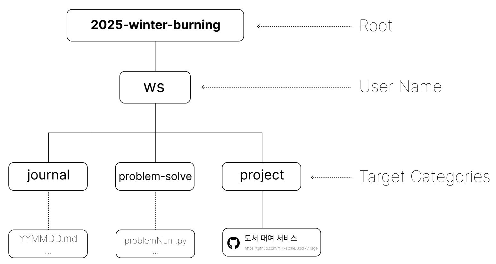

# 2025년 겨울, 1달의 기적

기간 : 2025년 1월 17일 (금) ~ 미정

## 목표

: Backend 코드 파워 증진, PS 솔브드 플레티넘4 달성, 정보처리기사 자격증 취득 등..

## Github

레포지토리 이름 : 2025-winter-burning

링크 : https://github.com/milk-stone/2025-winter-burning

### 폴더 구조

- journal : 일지 작성 후 업로드
    - Markdown과 친해지기. → Notion으로 작성 후 옮기는 것도 가능.
    - 학습한 날의 일지를 적으면 됨. 일지 내용은 자유롭게. (누구나 읽기 쉽도록 개조식으로 정리하는 것을 권장)
- ps : Problem-solve 문제 풀이 후 코드 업로드
    - 파이썬, 자바 등 원하는 언어 사용 가능
    - 문제 자유롭게 선택
- spring : 새로운 스프링 프로젝트 생성 후 개발하고 싶었던 것들 개발하기
    - 개발하고 싶은 목록들 Issue에 작성할 예정.
    - 기능 단위 Push, Git close로 issue 닫기.

### 커밋 컨벤션

- journal : 작성한 일지 commit & push
    
    📒 멘트 예시
    
    > Journal : 2025년 1월 24일 금요일 일지 작성
      
    내용: [xxxxx.py](http://xxxxx.py) 작성
    
- ps : 풀이한 문제 코드 commit & push
    
    ✅ 멘트 예시
    
    > ps : [xxxxx](http://xxxxx.py)번 문제 풀이 완료
      
    사용한 언어 : python
    
- spring : 작성한 기능 단위로 push
    
    🛠 멘트 예시
    
    > feat : 카카오 로그인 API 구현
      
    적고싶은 내용들

---
### Problem Solve

### 생각

: 현재 파이썬으로 문제를 풀이하고 있지만, Java로 코딩 테스트를 보는 기업이 많아지는 추세에 맞추어 Java로 언어를 변경할 예정임.

### 최종 목표

- Python : 어려운 문제 도전하기 (플레티넘 4 달성을 목표로)
- Java : 자바 언어를 잘 다룰 수 있는 정도의 실력에 도달하기 위해서 기본기를 다지고, 이후에는 어려운 문제도 자바 언어로 도전하기
- Kotlin : 요즘 코틀린이 대세라고 하던데, 코틀린과도 익숙해지기

### 단기 목표

- 1일 1백준 : [Solved.ac](http://Solved.ac) 스트릭 채우기
- 자바 알고리즘 인터뷰 책 정독
- 매일 학습한 내용 일지 적기

---

### Backend - Spring Boot

### 생각

: (주)윔 에서 인공지능 분야 및 다른 직원들의 업무를 엿보니, 인공지능 쪽으로 학습을 이어나가기엔 학부 과정과 조금 떨어진 학습이라고 생각했고, 학습하기에 막막함을 느꼈음. 백엔드를 공부하다가 회의감을 느껴 다른 분야에 부딪혀 봐야겠다고 생각했었지만, 실제로 경험해보니 다시 백엔드 공부를 깊게 하는 것이 더 미래에 도움이 될 것 같다는 생각을 함. 약 1달 반 동안 놓고 있었던 Spring Boot를 다시 공부할 예정임.

### 최종 목표

- Spring Boot를 해오면서 해보고 싶었던 기능들 구현해보기
    - 카카오, Google 로그인 API 연결 후 내용 정리
    - 회원 가입 시 메일로 인증 받는 로직 추가해보기
    - Spring Security 심도 있게 학습
    - GCP 이용해 배포 해보기
    - Docker를 이용해 배포 해보기 → Github Action 배포 자동화 실습 해보기
- 책을 통해 지식 획득
    - Real MySQL 8.0
    - 스프링 부트로 개발하는 MSA 컴포넌트
    - 이펙티브 자바
    - 이펙티브 코틀린
- 어느정도 학습을 한 후 (주)윔의 백엔드 개발자님께 모르는 것 물어보기

### 단기 목표

- 종프1 프로젝트를 참고하여 CRUD 만들어보기 - 프론트 한 명 고용하는 것도 고려해보기
- 학습한 내용 일지 적기

---

### 정보처리기사

: 2025년 2월 17일 월요일 12:40 필기 시험 통과하기

---

### 3학년 2학기 학습 내용 정리하기

1. 알고리즘2
    - 피피티 챕터 별로 주요 개념 정리
    - 관련 문제 BOJ에서 찾아서 풀기
2. 데이터베이스
    - 피피티 내용 정리 (주요한 부분만)
    - 챕터별 X 주제별로 정리

---

### 윔에서 간단하게라도 작업했던 코드들 깃허브에 올려보기

- yolo 모델 학습 과정, 데이터 라벨링 후 데이터 정제하는 코드 등