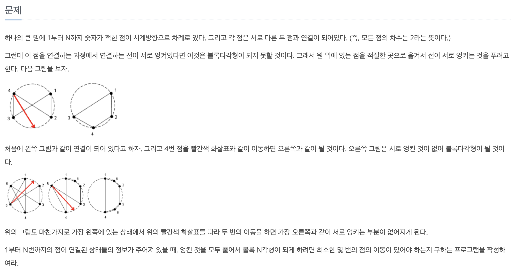
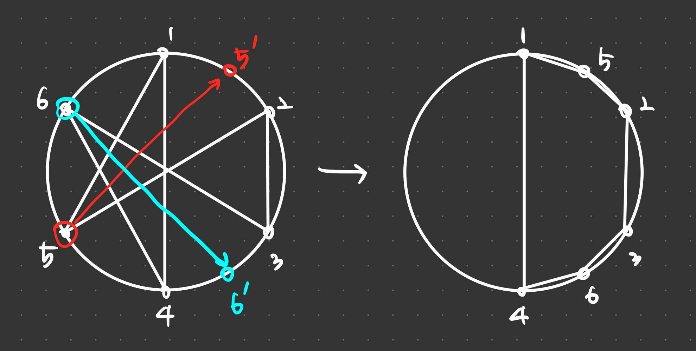
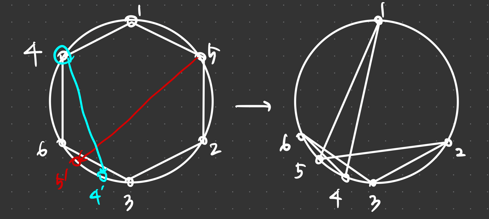

# PS

## 풀이한 문제

1847번 : 볼록다각형 만들기

링크 : https://www.acmicpc.net/problem/1847



### 풀이





### Key Idea

꼬인 상태 → 볼록다각형 상태 로 변환할 때 정점의 최소 이동 횟수와
볼록다각형 상태 → 꼬인 상태로 변환할 때 정점의 최소 이동 횟수는 동일하다!

볼록다각형 상태 → 꼬인 상태로 변환할 때 정점의 최소 이동 횟수를 구해보자.

볼록다각형 상태 : 한 정점을 시작점으로 잡고, DFS를 진행했을 때 방문하는 정점의 순서가 곧 볼록다각형을 만드는 정점 순서이다.

(모든 정점의 차수는 2이고, 모든 정점이 한 component를 이룬다면 이 그래프는 단일 사이클 하나만 가진다.)

두번째 그림의 왼쪽 원에서, 볼록다각형을 만드는 정점의 순서는

**[1, 5, 2, 3, 6, 4]** 과 **[1, 4, 6, 3, 2, 5]** 가 될 수 있고, 이 두 가지 상태로 부터 **[1, 2, 3, 4, 5, 6]** 의 순서를 만들어야한다!

### Case 1

[1, 5, 2, 3, 6, 4] → [1, 2, 3, 4, 5, 6]

[1, 5, 2, 3, 6, 4]의 LIS(Longest Increase Subsequence)는 4임.

최대 4개의 원소가 정렬된 상태를 유지하므로, 전체 원소에서 4개를 제외한 6-4 = 2개의 원소를 제 자리로 옮기면 됨 ⇒ 최소 이동 횟수: 2회

### Case 2

[1, 4, 6, 3, 2, 5] → [1, 2, 3, 4, 5, 6]

[1, 4, 6, 3, 2, 5]의 LIS는 3임.

최대 3개의 원소가 정렬된 상태를 유지하므로, 전체 원소에서 3개를 제외한 6-3 = 3개의 원소를 제 자리로 옮기면 됨 ⇒ 최소 이동 횟수: 3회

Case 1 일 때의 횟수가 2회로 더 적으므로 최소 이동 횟수는 2회임.

### 정리

모든 경우의 수를 고려

: 시작 정점 (1~N), 시작 정점에서의 탐색 방향(왼쪽, 오른쪽)을 모두 고려해야함.

1. 시작 정점 및 탐색 방향 특정
2. 볼록다각형을 이루는 정점 순서 리스트 구하기 (DFS 이용)
3. 그 리스트의 LIS 구한 후, 현재까지 계산한 최대 LIS 값보다 크다면 값 업데이트

출력 : (리스트의 길이 - LIS의 최댓값)

### Code

```python
import sys
import bisect

sys.setrecursionlimit(10**7)

input = sys.stdin.readline

def dfs(start):
    global G, visited, path
    visited[start] = True
    path.append(start)
    for nextNode in G[start]:
        if not visited[nextNode]:
            dfs(nextNode)
    return

def lis_length(seq):
    dp = []
    for a in seq:
        pos = bisect.bisect_left(dp, a)
        if pos == len(dp):
            dp.append(a)
        else:
            dp[pos] = a
    return len(dp)

V = int(input())
if V <= 2:
    print(-1)
    exit(0)

G = [[] for _ in range(V+1)]
for v in range(1, V + 1):
    left, right = map(int, input().split())
    G[v].append(left)
    G[v].append(right)

ans = -1
for start in range(1, V+1):
    for index in [0, 1]:
        visited = [False for _ in range(V + 1)]
        visited[start] = True
        path = [start]
        dfs(G[start][index])

        t = lis_length(path)
        if len(path) != V:
            print(-1)
            exit(0)
        if t > ans: ans = t
        # print(path)
        path.reverse()
        # print(path)

        t = lis_length(path)
        if len(path) != V:
            print(-1)
            exit(1)
        if t > ans: ans = t

print(V - ans)
```

## Reference

- ICPC 공식 솔루션 (C언어)
    
    링크 : https://org.coloradomesa.edu/~wmacevoy/rmrc/2006/index.html
    
    ```python
    /*
     * Solution for The Human Knot
     *
     * Howard Cheng
     *
     * The only unsolvable configuration occurs when the people form disjoint
     * cycles.  Otherwise, it is solvable.
     *
     * In the solvable case, the optimal solution must leave one person
     * unmoved.  So we try keeping each person stationary, and determine
     * the optimal solution with the person fixed.  So we find out what
     * the order of the other people should be.  Anyone else who is not
     * moved must form an increasing or decreasing subsequence (there are
     * two ways to sort the ring).  So we look for the longest increasing
     * and decreasing subsequence, and subtract the length from n-1.  This
     * gives us the minimum number of moves.
     *
     * Complexity: n stationary people, O(n log n) for increasing/decreasing
     * subsequence: O(n^2 log n).
     *
     * If we want to allow O(n^2) longest increasing subsequence as a solution,
     * just change maximum n to be 150 or so.
     *
     */
    
    #include <stdio.h>
    #include <string.h>
    #include <assert.h>
    
    #define MAX_N 500
    
    int graph[MAX_N+1][2];     /* use 1-based array */
    int n;
    
    /* longest increasing subsequence, return length */
    int inc_seq(int *A, int n);
    /* longest decreasing subsequence */
    int dec_seq(int *A, int n);
    
    /* figure out the correct order for each person, return number in the ring */
    int fill_order(int start, int *order);
    
    int read_case(void);
    void solve_case(void);
    
    FILE *in, *out;
    
    int main(void)
    {
      in = fopen("humanknot.in", "r");
      out = fopen("humanknot.out", "w");
      assert(in && out);
      while (read_case()) {
        solve_case();
      }
      return 0;
    }
    
    /* longest increasing subsequence, return length */
    int inc_seq(int *A, int n)
    {
      int m[MAX_N+1], i, k, j, h, e;
    
      i = k = 1;
      m[1] = 0;
      for (; i < n; i++) {
        if (A[i] >= A[m[k]]) {
          m[k+1] = i;
          k++;
        } else if (A[i] < A[m[1]]) {
          m[1] = i;
        } else {
          assert(A[m[1]] <= A[i] && A[i] < A[m[k]]);
          h = 1;
          j = k;
          while (h != j-1) {
    	e = (h+j)/2;
    	if (A[m[e]] <= A[i]) {
    	  h = e;
    	} else {
    	  j = e;
    	}
          }
          m[j] = i;
        }
      }
    
      return k;
    }
    
    /* longest decreasing subsequence */
    int dec_seq(int *A, int n)
    {
      int B[MAX_N];
      int i;
    
      for (i = 0; i < n; i++) {
        B[i] = A[n-i-1];
      }
      return inc_seq(B, n);
    }
    
    int fill_order(int start, int *order)
    {
      char used[MAX_N+1];
      int k = 0, t = start;
    
      /* order[k] is position of person start+k (mod n) */
    
      memset(used+1, 0, n);
      while (k < n) {
        order[(t+n-start)%n] = k++;
        used[t] = 1;
        if (!used[graph[t][0]]) {
          t = graph[t][0];
        } else if (!used[graph[t][1]]) {
          t = graph[t][1];
        } else {
          break;
        }
      }
    
      return k;
    }
    
    int read_case(void)
    {
      int i;
    
      fscanf(in, "%d", &n);
      if (!n) {
        return 0;
      }
    
      for (i = 1; i <= n; i++) {
        fscanf(in, "%d %d", &(graph[i][0]), &(graph[i][1]));
      }
      return 1;
    }
    
    void solve_case(void)
    {
      int order[MAX_N];
      int fixed, t;
      int len = 0;
    
      for (fixed = 1; fixed <= n; fixed++) {
        if (fill_order(fixed, order) != n) {
          /* cannot get all n people, not solvable */
          fprintf(out, "Not solvable.\n");
          return;
        }
        if ((t = inc_seq(order+1, n-1)) > len) {
          len = t;
        }
        if ((t = dec_seq(order+1, n-1)) > len) {
          len = t;
        }
      }
    
      fprintf(out, "Knot solvable.\n%d\n", n-1-len);
    }
    
    ```
    