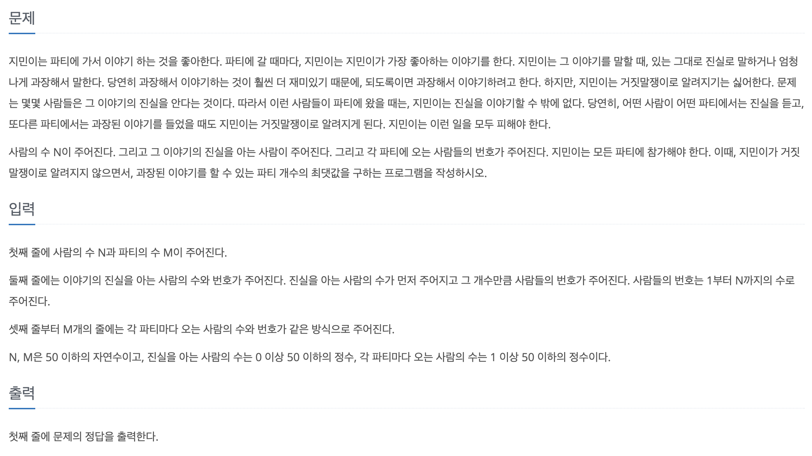

# PS

## 풀이한 문제

1043번 : 거짓말

링크 : https://www.acmicpc.net/problem/1043



### Key Idea

**진실을 아는 사람과 같은 파티에 있을 모든 사람들**에게 거짓말을 하면 안된다!

진실을 아는 사람과 같은 파티에 있었던 사람은 진실을 아는 사람이 된다. (진실을 아는 사람이 업데이트 됨)

앞으로, 진실을 아는 사람들의 세트를 knowSet 라고 하겠다.

파티가 M개 있을 때,

> 1번째 파티, 2번째 파티, … , i번째 파티, …, M번째 파티
> 

파티 M개를 1회 순회하는 것으로 모든 관계를 파악할 수 없다!

i번째 파티에서 knowSet이 업데이트 되면, `1` ~ `i-1` 번째 파티에서의 거짓말 가능 여부가 바뀔 수 있기 때문이다.

### 그렇다면, 파티 M개를 몇 번 순회해야하는가?

최악의 경우를 상상해보자.

<aside>
💡

- 첫 번째 순회에서 `M`번째 파티로 인해 knowSet이 업데이트 되고, 두 번째 순회에서 `M-1` 번째 파티의 거짓말 가능 여부가 바뀐다.
- 두 번째 순회에서 `M-1` 번째 파티로 인해 knowSet이 업데이트 되고, 세 번째 순회에서 `M-2` 번째 파티의 거짓말 가능 여부가 바뀐다.

…

- `M-1` 번째 순회에서 두 번째 파티로 인해 knowSet이 업데이트 되고, `M` 번째 순회에서 첫 번째 파티의 거짓말 가능 여부가 바뀐다.
- `M` 번째 순회에서 첫 번째 파티로 인해 knowSet를 업데이트한다.
</aside>

따라서, 파티 `M`개를 순회하는 행위를 `M`번 수행해야한다!

### Code

```python
import sys

input = sys.stdin.readline

N, M = map(int, input().split())

knowSet = set(input().split()[1:])
parties = []

for _ in range(M):
    parties.append(set(input().split()[1:]))

for _ in range(M):
    for party in parties:
        if party & knowSet:
            knowSet = knowSet.union(party)

ans = 0
for party in parties:
    if party & knowSet:
        continue
    ans += 1
print(ans)
```

### 후기

처음에는 사람 번호를 정점으로 하고, 파티 연결 정보를 간선으로 연결하여 그래프를 만들어 BFS를 이용해 connected component를 구분하려고 했다.

파티에 사람이 중복되는 경우가 많아, 그래프 간선 연결을 다 하는 것이 효율적이지 못하다고 생각했고(중복이 많기 때문), Union Find 자료구조를 사용하는 방법을 고려하기 시작했다.

하지만 잘 해결되지 않았고, Reference를 찾아보니 Set 자료형으로 너무나 쉽게 풀이한 블로그를 발견했다.

풀이를 하는 방향은 어느정도 일치했다고 생각하지만, 결국 풀어내지 못했다는 것이 너무 아쉽고, 다음부터 문제를 풀 때 Set 자료형을 적재적소에 쓸 수 있게 연습해야겠다고 생각했다.

- Set 자료형 : & 연산으로 교집합을, | 연산으로 합집합을 구할 수 있다. (물론, knowSet.union() 같은 메서드도 존재한다.)

## Reference

- https://ku-hug.tistory.com/148
    
