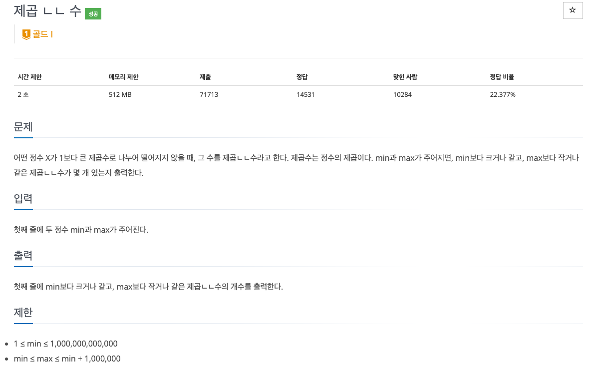

# PS

## 풀이한 문제

1016번 : 제곱ㄴㄴ수

링크 : https://www.acmicpc.net/problem/1016



### 문제 풀이에 앞서…

우선 문제를 제대로 읽자.

> **제곱ㄴㄴ수** : 1보다 큰 제곱수로 나누어 떨어지지 않는 정수
> 

4, 9, 16, … 로 나누어 떨어지지 않는 정수!

문제 분류가 `에라토스테네스의 체` 인 이유가 있다!

### 규칙이 있는가?

에라토스테네스의 체 애니메이션을 참고하자.


### 예시 1

input : `1, 10` 

output : `7` (1, 2, 3, 5, 6, 7, 10)

1, 2, 3, 4, 5, 6, 7, 8, 9, 10

- 4로 나누어 떨어지는 수인 4, 8 제외
- 9로 나누어 떨어지는 수인 9 제외

⇒ 7개!

### 예시 2

input : `20, 40` 

output : `13` 

20, 21, 22, 23, 24, 25, 26, 27, 28, 29, 30
31, 32, 33, 34, 35, 36, 37, 38, 39, 40

- 4로 나누어 떨어지는 수인 20, 24, 28, 32, 36, 40 제외
- 9로 나누어 떨어지는 수인 27 제외, 36은 이미 제외된 상태임.
- 16으로 나누어 떨어지는 수인 32는 이미 제외된 상태임.
- 25로 나누어 떨어지는 수인 25 제외
- 36으로 나누어 떨어지는 수인 36은 이미 제외된 상태임.

⇒ 13개!

### 에라토스테네스의 체를 조금 변형!

에라토스테네스의 체는

1. 작은 수 부터 차례로 선택.
2. 선택한 수가 소수일 경우 그 수를 찾고, 남은 수들 중에서 그 소수의 배수를 모두 삭제

(변형)

제곱ㄴㄴ수는

1. 작은 제곱수 부터 차례로 선택.
2. 입력 받은 구간에 있는 수들 중, 선택한 수의 배수를 모두 삭제

이 과정을 모두 거친 후 남아있는 수는 어떤 제곱수의 배수도 아닌 제곱ㄴㄴ수임.

나눌 제곱수는 4, 9, 16, … 어느정도 크기까지 선택해야하는가? → `maxValue의 제곱근 + 1` 까지!

⇒ 에라토스테네스의 체 증명을 참고하자.

제곱수를 선택했다면 나눌 수는 해당 제곱수의 배수 중에서, 구간 시작 값보다 크면서 구간 시작 값과 가장 가까운 배수를 시작점으로 선택! 이후, 나눌 수에 제곱수 만큼 더해가며 나눠보면 된다.

```python
for j in range(math.ceil(a / d_factor) * d_factor, b + 1, d_factor):
```

### Code

```python
import sys
import math

input = sys.stdin.readline

a, b = map(int, input().split())

answer = b - a + 1

checkList = [False for _ in range(b - a + 1)]

for i in range(2, int(b ** 0.5) + 1):
    d_factor = i ** 2
    for j in range(math.ceil(a / d_factor) * d_factor, b + 1, d_factor):
        if not checkList[j - a]:
            checkList[j-a] = True
            answer -= 1

print(answer)
```

### 후기

- 에라토스테네스의 체 증명을 숙지해야 할 것 같다.
- 에라토스테네스의 체를 완벽하게 이해하고, 이 문제를 보고 그 개념을 떠올릴 수 있다면 쉽게 풀었을 것 같다.

## Reference

- https://velog.io/@superhong/%EB%B0%B1%EC%A4%80-1016%EB%B2%88-%EC%A0%9C%EA%B3%B1-%E3%84%B4%E3%84%B4-%EC%88%98-Python
- https://hgk5722.tistory.com/139
