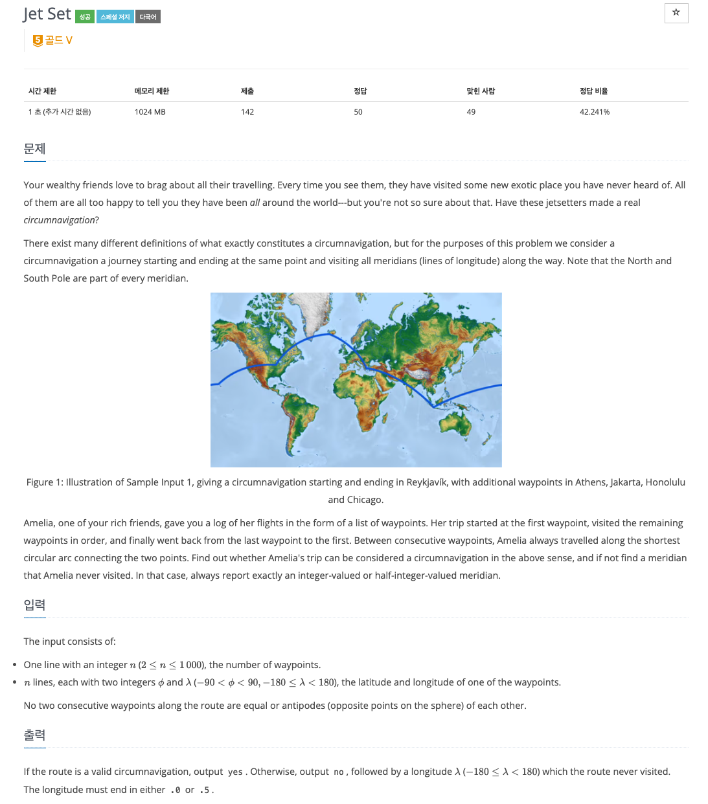
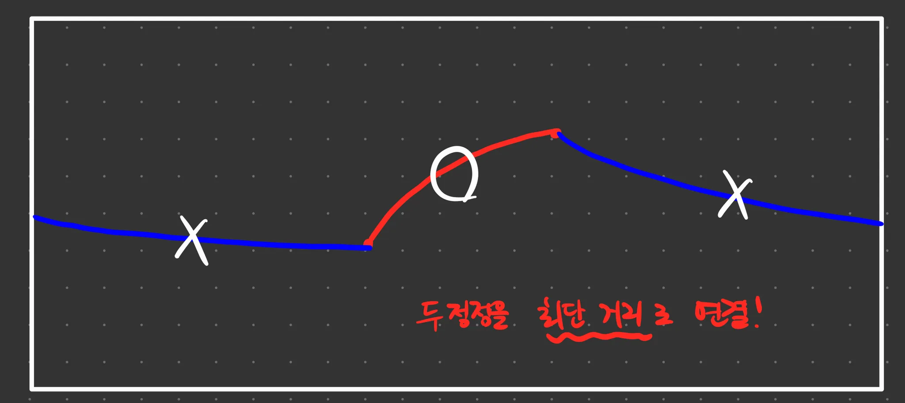
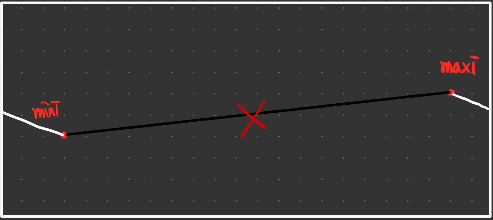

# PS

## 풀이한 문제

23776번 : Jet Set

링크 : [https://www.acmicpc.net/problem/23776](https://www.acmicpc.net/problem/1016)



### 문제 풀이에 앞서 문제를 제대로 이해해보자…

구할 것 : Circumnavigation 경로 찾기!

**경로를 구성하는 규칙**

1. 입력으로 (위도, 경도) 정점을 입력받고, 입력받는 정점 순서대로 이동한다.
2. 각 정점끼리 이동할 때, 최단 거리로 이동해야한다.




1. 마지막 점과 첫 점을 이었을 때, Circumnavigation 경로가 되어야 한다. 세계 일주 즉, 지구를 한 바퀴 돌아야 한다. 만든 경로가 모든 **경도(세로선)**를 다 지날 경우 Circumnavigation 경로라 한다.
2. 만든 경로가 Circumnavigation 일 경우 “yes”를 출력하고,
아닐 경우 “no”와 지나지 않는 경도를 하나 출력한다. 경도의 출력 형식은 xxx.0 혹은 xxx.5 이다.

### 경도를 지났는지 체크하기

- 지나온 경도로 0, 1, 2, … 뿐만 아니라 0.5, 1.5, 2.5, … 와 같이 .5로 끝나는 것도 될 수 있다.
따라서, 경도를 지났는지 체크하는 visited 배열의 길이를 720으로 지정한다. (-180 ~ 179.5 : 720개)
- 입력으로 받는 경도 값은 항상 정수로 주어진다. (-180 ~ 179)
- 배열의 인덱스에 매핑하기 위해서, 모든 경도값에 +180을 해서 생각하기로 했다.
    - -180 ⇒ 0, 0 ⇒ 180, 179 ⇒ 359
- -180도를 인덱스 0으로, -179.5도를 인덱스 1으로, -179도를 인덱스 2로, … 처럼 매핑시키기 위하여 (경도값*2), (경도값*2 + 1) 로 .0과 .5를 기록할 수 있게 한다. (글로 적는게 너무 어렵다.)

### 정점끼리 연결

기본

- 두 정점의 경도 값의 차이를 구한다. 두 경도 값을 큰 값(maxi), 작은 값(mini)으로 구분한다.
1. maxi - mini 값이 0인 경우 → 두 정점의 경도가 동일하다.
⇒ 새로 체크할 경도값이 없다.
2. maxi - mini 값이 180인 경우 → 두 정점이 서로 정반대 경도에 있다.
⇒ 정반대 위도 값을 가지고 있기 때문에, 시계방향 거리와 반시계방향 거리가 동일하게 최단 거리이다.
이 경우 두 정점만으로도 반드시 지구를 순환할 수 있게 된다. 따라서 “yes”를 출력하고 프로그램을 종료한다.
3. maxi - mini 값이 180보다 작은 경우
    
    
    
    mini ~ maxi 사이의 모든 경도를 다 체크한다.
    
4. maxi - mini 값이 180보다 큰 경우
    
    
    
    0 ~ mini 와 maxi ~ 359 사이의 경도를 다 체크한다.
    

경도 체크 함수 : fill()

### 특이한 점

위도는… 문제를 풀이하는 데 쓰이지 않는다. 입력을 받지도 않는다…(무시한다)

### Code

```python
import sys

input = sys.stdin.readline

N = int(input())
visited = [False for _ in range(360 * 2)]
last = (int(input().split()[1]) + 180) % 360
first = last

def fill(f, t):
    for i in range(f, t):
        visited[i] = True

def doit(cur, last):
    mini = min(cur, last)
    maxi = max(cur, last)
    diff = maxi - mini

    if diff == 0:
        return
    # if diff % 180 == 0: # diff == 180 이랑 똑같은 효과를 낼 듯
    if diff == 180:
        print("yes")
        exit(0)
    if diff < 180:
        fill(mini * 2, maxi * 2 + 1)
    else:
        fill(0, mini * 2 + 1)
        fill(maxi * 2, 360 * 2)

for i in range(1, N):
    cur = (int(input().split()[1]) + 180) % 360
    doit(cur, last)
    last = cur
doit(first, last)

for i in range(0, 720):
    if not visited[i]:
        i = (i / 2) - 180
        # print(type(i))
        print("no %s" % (i))
        exit(0)
print("yes")
```

### 후기

- 영어로 된 문제를 이해하는게 너무 힘들다…
- 체크하고자 하는 것들을 추상적으로 배열과 같은 자료구조에 매핑하는 그 생각 과정이 가장 중요한 것 같다.

## Reference

- https://2021.nwerc.eu/files/nwerc2021slides.pdf
- https://2021.nwerc.eu/
여기서 `nwerc2021all.tar.bz2` 를 다운받은 후

```python
$ tar -xvf nwerc2021all.tar.bz2
```

명령어를 입력하면 압축이 해제된다.
