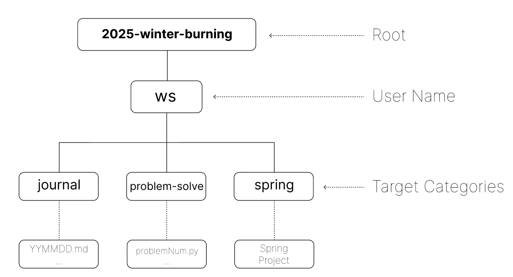

# 환경 구축

## Github

레포지토리 이름 : 2025-winter-burning

링크 : https://github.com/milk-stone/2025-winter-burning

### 폴더 구조

- journal : 일지 작성 후 업로드
    - Markdown과 친해지기. → Notion으로 작성 후 옮기는 것도 가능.
    - 학습한 날의 일지를 적으면 됨. 일지 내용은 자유롭게. (누구나 읽기 쉽도록 개조식으로 정리하는 것을 권장)
- ps : Problem-solve 문제 풀이 후 코드 업로드
    - 파이썬, 자바 등 원하는 언어 사용 가능
    - 문제 자유롭게 선택
- spring : 새로운 스프링 프로젝트 생성 후 개발하고 싶었던 것들 개발하기
    - 개발하고 싶은 목록들 Issue에 작성할 예정.
    - 기능 단위 Push, Git close로 issue 닫기.

### 커밋 컨벤션

- journal : 작성한 일지 commit & push
    
    📒 멘트 예시
    
    Journal : 2025년 1월 24일 금요일 일지 작성
    
    내용: xxxxx.py 작성

    
- ps : 풀이한 문제 코드 commit & push
    
    ✅ 멘트 예시
    
    ps : xxxxx번 문제 풀이 완료
    
    사용한 언어 : python

    
- spring : 작성한 기능 단위로 push
    
    🛠 멘트 예시
    
    feat : 카카오 로그인 API 구현
    
    적고싶은 내용들

## 학습한 내용을 정리하는 규칙 정립

### 깃허브 레포지토리 생성

링크 : https://github.com/milk-stone/2025-winter-burning

이 레포지토리에 학습 내용을 commit & push할 예정.

### 학습 일지 (Journal)

- 하루에 학습한 내용을 마크다운 언어 형식으로 정리
- PS 분야, Spring 프로젝트 상관 없음

### Problem-Solve

- 적절한 난이도의 문제를 선택해 풀고, 풀이 과정을 개조식으로 정리하는 것까지 완료하기
- 꼭 하루에 한 문제를 해결해내야할 필요는 없음. 진정한 학습을 목표로 하기

### Spring

- 개발하고픈 주제를 설정하고, 그 서비스를 개발하도록 노력하기
- 스프링 프로젝트 생성~배포 까지 완료하기

위 세가지 주제로 폴더를 나누어 업로드 할 예정임.

## 대표님과 상담

대표님께서 1달동안 진행했으면 하는 프로젝트를 소개해주셨음.

### 프로젝트 이름 : 한달의 기적 - 도서대여 프로그램 제작

목표

- 도서 대여 프로그램

준비물

- Front-end
    - 예전 네이버 홈페이지 ui 처럼 제작되어도 아무 상관 없다. 기능을 잘 사용할 수 있을 정도만 구현하는 것을 목표로 하자.
- Back-end
    - Logic(AI) -> LLM(RAG)
    - DB
- Agent AI
    - CS(예외처리) -> Prompt1
    - 대여/반납(시간관련) -> Prompt2
    - 비용(제품관련) -> Prompt3
    

정교한 SQL문과 DB 조작을 이용해 완성도 높은 서버를 개발할 수도 있지만, 현재 잘 작동하는 LLM을 이용해 같은 서비스를 더 빠르게 개발할 수 있다면 이 개발 능력은 소중한 자산이 될 것이라고 설명해주셨음.

프로젝트를 스스로 진행하고, 모르는 점이나 의논하고 싶은 점이 있으면 언제든지 피드백을 주겠다고 하셨음.